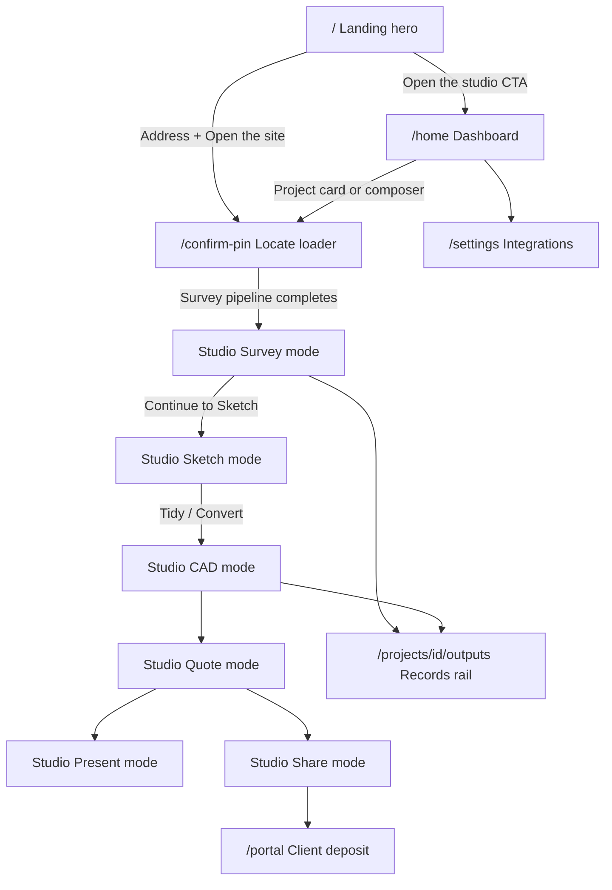

# Operator UX workflow (e2e-backed)

Recorded 2026-08-23. This is the **product UX** map: what an operator (and
client) sees, clicks, and where they land from first visit through quote and
share.

For dev setup, deploy, and Railway ops see
[`APPLICATION-WORKFLOW-2026-08-23.md`](APPLICATION-WORKFLOW-2026-08-23.md).
Binding canvas architecture still lives in `docs/GOLD-STANDARD-2026*.md`.

---

## Journey overview



---

## Stage 1 — Public landing (`/`)

**Entry:** Public. No sign-in gate. Full-viewport canvas-first shell
(`data-testid="workstream-landing"`).

**What the operator sees**

| Region | Copy / content |
|--------|----------------|
| Hero aerial | Sub-metre Esri imagery (default **10 Hopetoun Road, Toorak**); Ken Burns + parallax |
| Site analysis overlay | **WORKSTREAM / SURVEY · SITE ANALYSIS · 01 / LIVE** when Vicmap boundary loads |
| Headline | **From GIS Ingest to Client Sign-Off.** — sub **Skip the CAD.** |
| Address combobox | Placeholder **Enter your address**; auto-focused on fine pointer |
| Workflow cards | **The Studio Workflow** — eight steps (01 Live GIS Ingest … 08 Client Portal) |
| Trust chips | Vicmap cadastre, sub-metre aerial, optional live boundary chip |

**Primary actions**

| Control | Label | Destination |
|---------|-------|-------------|
| Top bar | **Open the studio** | `/home` |
| Top bar | **Settings** | `/settings` |
| Hero CTA | **Open the Studio** | `/home` |
| Address submit | **→** or **Open the site** | `/confirm-pin?address=…&lat=…&lng=…` |

**Address flow:** type ≥3 chars → debounced geocode → pick suggestion (re-centres hero + Vicmap boundary) → **Open the site** → confirm-pin.

**E2e proof:** [`apps/web/e2e/landing.spec.ts`](../apps/web/e2e/landing.spec.ts)

**UX gap:** spec stops at confirm-pin URL; it does not walk the locate loader into the studio.

---

## Stage 2 — Operator dashboard (`/home`)

**Entry:** `requireSignedIn()` — with Clerk off, returns `dev-user` locally (no sign-in screen).

**Layout**

- **AppNav** — Workstream brand, Projects, Settings, Lite/Studio plan pill
- **Left aside** — masthead, workspace chips (plan/seats/live channels), **New address** composer
- **Main** — **Projects register** with search, sort, card grid
- **Planner dock** — right rail (desktop) or bottom sheet (mobile): weather, focus sites, reminders, calendar, to-do

**Project cards**

- Primary link → `/projects/{id}` (studio)
- **Records** → `/projects/{id}/outputs`
- **Delete** → confirm dialog + undo toast (5 s)

**New address composer** (`NewProjectAddressForm`)

- Placeholder **Start typing — e.g. 6 Beatty Ave, Armadale**
- Tap a match → immediate `/confirm-pin?…` (unlike landing, which requires explicit **Open the site**)
- **Locate property →** button when query ≥5 chars

**Empty / error copy**

- **No projects yet** — *Start your first project with a Melbourne site address above.*
- **Could not load projects** — API unreachable (inline banner, not error boundary)

**E2e proof:** [`apps/web/e2e/dashboard-filter-sort.spec.ts`](../apps/web/e2e/dashboard-filter-sort.spec.ts), [`apps/web/e2e/verify-actions.spec.ts`](../apps/web/e2e/verify-actions.spec.ts)

**UX gap:** dashboard e2e seeds projects via API, not through the address composer UI.

---

## Stage 3 — First-create locate loader (`/confirm-pin`)

**What the operator sees:** full-bleed aerial zoom, status progression
(**Locating your property…** → **Zooming to the lot…** → capability phrases),
title boundary overlay, lot area when available.

**Backend:** `createProjectWithSurveyAction` — creates project + survey ingest.

**Success:** `router.replace(/projects/{id}?guide=1)` — WebGL studio with guide flag.

**Errors:** **Could not open site** + **Back to projects**; invalid params → **Missing address**.

**E2e proof:** none end-to-end (landing only asserts navigation **to** this route).

---

## Stage 4 — WebGL studio shell (`/projects/[id]?mode=…`)

The canvas route mounts `WebGLStudioPreview` — one WebGL surface; mode switches
change camera, layer policy, and dock panels without remounting the canvas.

### Chrome layout (all modes)

| Surface | Location | Role |
|---------|----------|------|
| Perimeter tab strip | Top centre | Mode tabs + meta tabs + live stats |
| Project identity | Top left | Address + active mode name |
| Workflow guide | Top left | `survey → sketch → cad → quote` with **Next:** hint |
| Tool rail | Left | Sketch, Measure, Assets, Polyline, Area, Marquee, Tidy, … |
| Right dock | Right (360px) | Mode panel + Inspector + Fit sheet |
| Assets dock | Bottom centre | Catalog fan-out |
| Selection chip | Bottom left | Multi-select count; Esc clears |

**Meta tabs:** Studio, Sun, Growth, Layers, Site, **Fit** (toggles fit sheet), Terrain (when spot levels exist).

**Zero-Chrome law:** DOM chrome lives in sibling `[data-testid=webgl-chrome-overlay]` — nothing inside the R3F `<Canvas>`.

### Progressive unlock

| Prerequisite | Unlocks |
|--------------|---------|
| Survey only (default) | Survey |
| `hasAerial` — survey carries aerial/title | Sketch, CAD, Elevation, Garden |
| `hasCad` — placements, features, or boundary | Quote, Present |
| `hasQuote` — persisted quote output | Share |

Survey checklist **5/5** is separate from mode unlock — **Continue to Sketch** stays disabled until `hasAerial`.

### Locked mode copy

| Locked mode | Message | Click routes to |
|-------------|---------|-----------------|
| Sketch / CAD / Elevation / Garden | Complete survey and title boundary first. | Survey |
| Quote / Present | Accept CAD geometry before quoting. | CAD |
| Share | Cost something on the drawing before sharing. | Quote |

**E2e proof (shell / chrome gates)**

| Spec | What it proves |
|------|----------------|
| [`webgl-default-mount.spec.ts`](../apps/web/e2e/webgl-default-mount.spec.ts) | Default mount without query params |
| [`canvas-first.spec.ts`](../apps/web/e2e/canvas-first.spec.ts) | Mode chrome |
| [`webgl-chrome-detector.spec.ts`](../apps/web/e2e/webgl-chrome-detector.spec.ts) | No DOM chrome inside canvas |
| [`webgl-chrome-collision.spec.ts`](../apps/web/e2e/webgl-chrome-collision.spec.ts) | Floating cards do not overlap |
| [`webgl-contrast-aa.spec.ts`](../apps/web/e2e/webgl-contrast-aa.spec.ts) | WCAG AA text in all five checked modes |
| [`webgl-chrome-coverage.spec.ts`](../apps/web/e2e/webgl-chrome-coverage.spec.ts) | Idle chrome surfaces on-screen |
| [`canvas-first-z-stack.spec.ts`](../apps/web/e2e/canvas-first-z-stack.spec.ts) | Four-tier z-stack ladder |
| [`webgl-preview-smoke.spec.ts`](../apps/web/e2e/webgl-preview-smoke.spec.ts) | `?webgl=1` mount |
| [`webgl-pan-zero-commit.spec.ts`](../apps/web/e2e/webgl-pan-zero-commit.spec.ts) | Pan perf (zero React commits) |
| [`webgl-studio-shortcuts.spec.ts`](../apps/web/e2e/webgl-studio-shortcuts.spec.ts) | Keyboard map |
| [`rail-drawer-hover.spec.ts`](../apps/web/e2e/rail-drawer-hover.spec.ts) | Rail drawer hover contract |

---

## Stage 5 — Survey mode

**Goal:** establish the digital twin before designing.

**Primary actions:** **Import site truth** (Vicmap); checklist rows (boundary, dwelling, trees, levels, services); **Continue to Sketch** when aerial exists.

**Canvas:** studio paper ground; utilities + easements visible; **Locating the property** overlay when boundary missing.

**E2e proof:** [`webgl-survey-setup.spec.ts`](../apps/web/e2e/webgl-survey-setup.spec.ts)

---

## Stage 6 — Sketch mode

**Goal:** concept ink on clean paper.

**Primary actions:** draw ink (auto-armed on entry); **Tidy → CAD proposals**; **Convert to CAD features**; flora ring; photo-sketch flow; Assets dock placement.

**E2e proof**

| Spec | Focus |
|------|-------|
| [`webgl-sketch-to-cad.spec.ts`](../apps/web/e2e/webgl-sketch-to-cad.spec.ts) | Tidy accept, convert persist, selection survives mode switch |
| [`webgl-photo-sketch-flow.spec.ts`](../apps/web/e2e/webgl-photo-sketch-flow.spec.ts) | Photo → hand sketch |
| [`webgl-flora-ring.spec.ts`](../apps/web/e2e/webgl-flora-ring.spec.ts) | Ranked planting suggestions |
| [`webgl-marquee-select.spec.ts`](../apps/web/e2e/webgl-marquee-select.spec.ts) | Marquee box select |

---

## Stage 7 — CAD mode

**Goal:** accepted geometry, dimensions, AI assist.

**Primary actions:** Studio CAD card (NL edits, ghost staging); drafting tools; communication dialect packs; asset fan-out.

**E2e proof**

| Spec | Focus |
|------|-------|
| [`webgl-communication-modes.spec.ts`](../apps/web/e2e/webgl-communication-modes.spec.ts) | Per-trade annotation packs |
| [`webgl-cad-annotations.spec.ts`](../apps/web/e2e/webgl-cad-annotations.spec.ts) | Dims + measure tape |
| [`webgl-drafting-tools.spec.ts`](../apps/web/e2e/webgl-drafting-tools.spec.ts) | Precision drafting |
| [`webgl-terrain-instruments.spec.ts`](../apps/web/e2e/webgl-terrain-instruments.spec.ts) | Drainage + earthworks |
| [`webgl-asset-fanout.spec.ts`](../apps/web/e2e/webgl-asset-fanout.spec.ts) | Place + persist |
| [`webgl-asset-row-plant.spec.ts`](../apps/web/e2e/webgl-asset-row-plant.spec.ts) | Hedge run |
| [`webgl-gizmo-move.spec.ts`](../apps/web/e2e/webgl-gizmo-move.spec.ts) | Placement gizmo |
| [`webgl-camera-mode-entry.spec.ts`](../apps/web/e2e/webgl-camera-mode-entry.spec.ts) | Camera on mode entry |

---

## Stage 8 — Elevation / Garden

| Mode | Operator sees |
|------|---------------|
| **Elevation** | Centred elevation board (N/E/S/W looks); horizon camera (90°) |
| **Garden** | Eye-level walkthrough (76°); site material ground |

**E2e proof:** [`webgl-photo-trace-elevation.spec.ts`](../apps/web/e2e/webgl-photo-trace-elevation.spec.ts), [`webgl-split-view.spec.ts`](../apps/web/e2e/webgl-split-view.spec.ts)

---

## Stage 9 — Quote mode

**Goal:** review live AUD estimate.

**Primary actions:** fit sheet auto-opens expanded; line include/exclude ticks; stock pulse chips (IN STOCK / LOW STOCK / AI EST).

**E2e proof:** [`webgl-fit-sheet.spec.ts`](../apps/web/e2e/webgl-fit-sheet.spec.ts), [`floating-quotation-capsule.spec.ts`](../apps/web/e2e/floating-quotation-capsule.spec.ts)

---

## Stage 10 — Present / Share

| Mode | Operator sees |
|------|---------------|
| **Present** | Full-bleed `PresentSurface` deck over the design |
| **Share** | Centred `ShareSurface` — ghost verification, portal URI (requires persisted quote) |

**E2e proof:** [`present-surface-state.spec.ts`](../apps/web/e2e/present-surface-state.spec.ts)

---

## Stage 11 — Records surfaces (off-canvas)

**Navigation:** Studio meta panel → **Outputs**; or dashboard card **Records** link. Surface rail appears on record pages (never over the canvas).

**Surfaces:** Outputs, Audit, Carbon, Measurements, Recordings, Growth studio, Subsurface studio. Recordings hero offers **Follow pipeline progress** → `/projects/{id}/processing`.

**E2e proof:** [`project-surface-reachability.spec.ts`](../apps/web/e2e/project-surface-reachability.spec.ts)

---

## Stage 12 — Client portal

**Layout:** full-viewport gradient shell — **no operator AppNav**. Access is token-only via magic links (`POST /projects/:id/magic-link`).

| Route | Client sees |
|-------|-------------|
| `/portal/quote/[token]` | Garden quote — Lean / Standard / Buffer scenarios; **Accept & pay {20%} deposit** |
| `/portal/deposit/[token]` | Stripe checkout (live) or **CHECKOUT PREVIEW** (dev fallback) |
| `/portal/deposit-success` | **DEPOSIT RECEIVED** |
| `/portal/deposit-cancel` | **CHECKOUT CANCELLED** / **NO PAYMENT TAKEN** |

Invalid token: **This link has expired. Contact your landscaper.**

**E2e proof:** [`portal-deposit-flow.spec.ts`](../apps/web/e2e/portal-deposit-flow.spec.ts), [`portal-deposit-token.spec.ts`](../apps/web/e2e/portal-deposit-token.spec.ts)

---

## Stage 13 — Settings

**Entry:** AppNav with **Curtis & Co** subtitle. Plan pill from integration summary.

**`/settings` sections:** Workspace (plan/seats/live channels + next steps), License card, Integrations (Live / dev fallback / Not set), Recent events.

**`/settings/license`:** no AppNav — Stripe checkout return banners; member list; upgrade/add-seat CTAs (disabled when price IDs unset).

**Dev-user typical state:** Lite plan, 1 seat, dev fallbacks, pending integration steps.

**E2e proof:** [`settings-pages.spec.ts`](../apps/web/e2e/settings-pages.spec.ts)

---

## Error UX

| Boundary | Headline | Where |
|----------|----------|-------|
| App root | **That didn't land.** | `/home` throw (e.g. API down) |
| Project studio | **The drawing hit an error.** | `/projects/[id]/*` |
| Portal | **We couldn't load this client portal.** | `/portal/*` |

**E2e proof:** none — error boundaries not covered. Home API list failure shows inline **Could not load projects** instead.

---

## E2e coverage map (all 36 specs)

| Spec file | Journey stage | Category |
|-----------|---------------|----------|
| `landing.spec.ts` | Stage 1 Landing | Journey |
| `dashboard-filter-sort.spec.ts` | Stage 2 Dashboard | Journey |
| `verify-actions.spec.ts` | Stage 2 Dashboard | Journey |
| `webgl-survey-setup.spec.ts` | Stage 5 Survey | Journey |
| `webgl-sketch-to-cad.spec.ts` | Stage 6 Sketch | Journey |
| `webgl-photo-sketch-flow.spec.ts` | Stage 6 Sketch | Journey |
| `webgl-flora-ring.spec.ts` | Stage 6 Sketch | Journey |
| `webgl-marquee-select.spec.ts` | Stage 6 Sketch | Journey |
| `webgl-communication-modes.spec.ts` | Stage 7 CAD | Journey |
| `webgl-cad-annotations.spec.ts` | Stage 7 CAD | Journey |
| `webgl-drafting-tools.spec.ts` | Stage 7 CAD | Journey |
| `webgl-terrain-instruments.spec.ts` | Stage 7 CAD | Journey |
| `webgl-asset-fanout.spec.ts` | Stage 7 CAD | Journey |
| `webgl-asset-row-plant.spec.ts` | Stage 7 CAD | Journey |
| `webgl-gizmo-move.spec.ts` | Stage 7 CAD | Journey |
| `webgl-camera-mode-entry.spec.ts` | Stage 7 CAD | Journey |
| `webgl-photo-trace-elevation.spec.ts` | Stage 8 Elevation | Journey |
| `webgl-split-view.spec.ts` | Stage 8 Garden | Journey |
| `webgl-fit-sheet.spec.ts` | Stage 9 Quote | Journey |
| `floating-quotation-capsule.spec.ts` | Stage 9 Quote | Journey |
| `present-surface-state.spec.ts` | Stage 10 Present | Journey |
| `project-surface-reachability.spec.ts` | Stage 11 Records | Journey |
| `portal-deposit-flow.spec.ts` | Stage 12 Portal | Journey |
| `portal-deposit-token.spec.ts` | Stage 12 Portal | Journey |
| `settings-pages.spec.ts` | Stage 13 Settings | Journey |
| `webgl-default-mount.spec.ts` | Stage 4 Shell | Chrome / perf |
| `canvas-first.spec.ts` | Stage 4 Shell | Chrome / perf |
| `webgl-chrome-detector.spec.ts` | Stage 4 Shell | Chrome / perf |
| `webgl-chrome-collision.spec.ts` | Stage 4 Shell | Chrome / perf |
| `webgl-contrast-aa.spec.ts` | Stage 4 Shell | Chrome / perf |
| `webgl-chrome-coverage.spec.ts` | Stage 4 Shell | Chrome / perf |
| `canvas-first-z-stack.spec.ts` | Stage 4 Shell | Chrome / perf |
| `webgl-preview-smoke.spec.ts` | Stage 4 Shell | Chrome / perf |
| `webgl-pan-zero-commit.spec.ts` | Stage 4 Shell | Chrome / perf |
| `webgl-studio-shortcuts.spec.ts` | Stage 4 Shell | Chrome / perf |
| `rail-drawer-hover.spec.ts` | Stage 2 Planner dock | Chrome / perf |

**Not covered by any spec:** Stage 3 confirm-pin loader (full walkthrough), home address composer UI, all three error boundaries, auth sign-in UX in bootstrap mode.

---

## Known UX / e2e gaps

| Issue | UX impact |
|-------|-----------|
| No e2e for confirm-pin → studio | First-create loader unverified in browser |
| No e2e for `/home` address composer | Main create path untested via UI |
| No error-boundary e2e | **That didn't land** regression only caught in prod |
| Production bootstrap = shared `dev-user` | No sign-in UX; `/sign-in` redirects to `/home` |
| Landing at `/` vs docs saying redirect to `/home` | Two entry points — intentional |
| 11 chrome/perf specs | Quality gates, not operator journey narrative |

---

## How to run e2e

```bash
# Full suite — Playwright starts API + web (AUTH_REQUIRED=false, RATE_LIMIT_MAX=10000)
pnpm --filter @workstream/web test:e2e

# UX-critical journey subset
pnpm --filter @workstream/web exec playwright test \
  e2e/landing.spec.ts \
  e2e/dashboard-filter-sort.spec.ts \
  e2e/webgl-survey-setup.spec.ts \
  e2e/webgl-sketch-to-cad.spec.ts \
  e2e/webgl-fit-sheet.spec.ts \
  e2e/project-surface-reachability.spec.ts \
  e2e/settings-pages.spec.ts \
  e2e/portal-deposit-flow.spec.ts
```

**Gotcha:** [`playwright.config.ts`](../apps/web/playwright.config.ts) sets
`reuseExistingServer: !CI`. Reusing a plain `pnpm dev` API inherits production
rate limits — let Playwright start its own servers, or set `RATE_LIMIT_MAX=10000`
on the API.

GitLab runs three blocking e2e shards on `main`; Railway deploy starts only
after the repository gate, secret scan, and all Playwright shards pass.

---

## Typical operator day (plain language)

1. Land on **`/`** or open **`/home`** — type a Melbourne address, pick a GNAF match, wait through the confirm-pin loader.
2. **Survey** — import Vicmap site truth, finish the 5-step checklist, confirm aerial/title.
3. **Sketch** — draw concept ink; **Tidy** or **Convert** into CAD geometry.
4. **CAD** — refine with AI assist, dimensions, and asset placement.
5. Optional **Elevation** or **Garden** to review vertically or at eye level.
6. **Quote** — fit sheet shows live AUD estimate; toggle lines in/out.
7. **Present** for client walkthrough; **Share** once quote is persisted to publish the portal link.
8. **Records** surfaces for audit, carbon, measurements, growth studio — reachable from Outputs rail or dashboard **Records** link.

Throughout: left **tool rail** for draw/measure/place, right **inspector** when selected, **Fit** meta tab for costing, **Assets** dock for catalog. Locked mode tabs redirect to the prerequisite mode rather than failing silently.
