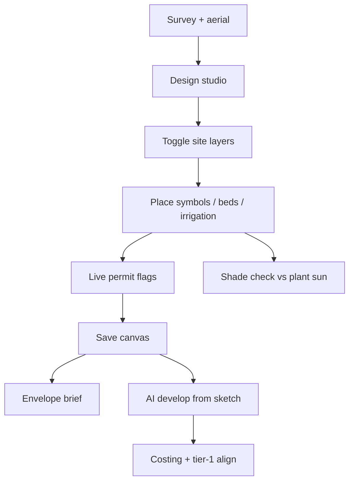

# Studio site intelligence — 2026 landscape UX brainstorm

**Audience:** Product, design, engineering  
**Surface:** Operator design studio (`/projects/:id/design`)  
**Phase:** [Workflow 1](./STUDIO-PRODUCT-PHASES.md) only — CAD UX, **indicative** overlays. Stage 2 (survey coords, DXF layers, dims) is out of scope here.

**Principle:** Concept sketch + **indicative** site intelligence — never survey-grade. Same honesty copy as [DESIGNER-HANDOVER.md](./DESIGNER-HANDOVER.md).

Companion: existing `planning-context.ts`, `site-environment.ts`, `SiteContextRibbon`, TRP catalog symbols, envelope brief.

---

## 1. What landscape designers actually need (2026, practical)

| Need | Typical tool today | Workstream opportunity |
| --- | --- | --- |
| Sun / shade over open space | SketchUp shadows, Rhino/Ladybug, hand rules | **AI-predicted shade bands** on aerial (time + season slider) |
| Tree protection | Arborist TPZ diagrams, AS 4970 | **TRP overlay** tied to placed trees + auto buffer |
| Underground services | Dial Before You Dig, council asset maps | **Utility overlay** (dashed, labelled, “confirm locate”) |
| Easements / title limits | Title plan PDF, Vicmap | **Easement hatch** on lot ring from survey/title |
| Permits & notifications | Spreadsheets, council portals | **Live permit rail** — flags update as sketch changes |
| Planting suitability | Sun/water spreadsheets | Link shade overlay → **palette filters** (sun metadata) |
| Client communication | Marked-up PDFs | Same overlays in **portal** (read-only, Curtis brand) |

Workstream wins by keeping **one canvas**, **one account**, and **one DNA** — not a second CAD app.

---

## 2. Unified model: layer stack (CAD-like, sketch-honest)

All intelligence renders in a single **overlay plane** above the aerial, below symbol handles. Toggle from ribbon tab **Site** (not buried in settings).

```text
┌─────────────────────────────────────────────────────────────┐
│ Ribbon: AI · Home · Plant · Annotate · Site                 │
├──────────────────────────────────────────┬──────────────────┤
│ Canvas (pan/zoom)                        │ Rail             │
│  ┌─ overlay stack (bottom → top) ─┐     │  AI / Schedule   │
│  │ easements (hatch)               │     │  Site inspector  │
│  │ utilities (dashed)              │     │  Library         │
│  │ TRP / TPZ rings                 │     └──────────────────┘
│  │ shade (gradient mesh, 40% α)    │
│  │ lot ring (existing)             │
│  │ symbols + strokes               │
│  └─────────────────────────────────┘
│  Status: 72% · 41.2%, 58.7% · Shade: 10:00 mid-winter      │
└─────────────────────────────────────────────────────────────┘
```

**Layer panel (micro-detail):** compact list in Site rail — each row: icon, label, opacity slider, eye toggle, **“Indicative”** micro-label in `--font-mono` 10px.

---

## 3. Design DNA (one system, no one-off chrome)

Reuse shipped tokens (`globals.css`) and patterns from `SiteContextRibbon` + studio ribbon.

| Element | Spec |
| --- | --- |
| **Overlay fills** | Semantic tokens only — no hex in modules. Proposed additions: `--overlay-shade`, `--overlay-trp`, `--overlay-utility`, `--overlay-easement` as `color-mix` on `--info` / `--warn` / `--block`. |
| **Line work** | Hairline `var(--line-hairline)` for easements; `1.5px dashed` utilities; `2px solid` TRP outer ring. |
| **Opacity** | Default overlay **0.38–0.48**; ghosts **0.48** (already); selected conflict **0.65** pulse (CSS only, no JS animation library). |
| **Chips** | Same as `SiteContextRibbon`: category icon + severity (`likely` / `review` / `clear`) — extend categories: `shade`, `utility`, `easement`. |
| **Typography** | Inter body; JetBrains Mono for coords, times, TPZ metres, permit IDs. |
| **Accent** | `--accent` only on primary CTAs (Save, armed tool) — **not** on overlay fills (keeps map readable). |
| **Honesty** | Every overlay footer: *“Indicative — confirm on site / title / locate.”* Permanent, not tooltip-only. |
| **Touch** | 44px layer toggles; 16px inputs in Site rail. |

**Micro-detail checklist:** 2px inset focus rings; `aria-pressed` on toggles; `role="img"` + `aria-label` on SVG overlays; snap readout to 0.1 m; season pill matches hub ribbon.

---

## 4. Feature brainstorm (by layer)

### 4.1 AI sun & shade (open space)

**User story:** “Where is full sun on the lawn at 3 pm in winter?”

**Logic (phase 1 — shippable without GL):**

- Build on `sunPositionAt` + `sunMarkerOnPlanPercent` (`packages/domain/src/site-environment.ts`).
- Given project `lat/lng`, **time slider** (06:00–20:00) + **date** (solstice presets: Jun 21 / Dec 21 / today).
- Render **shade wedge** from building footprint (Vicmap `house` polygon when available) + optional user-drawn “shade caster” line.
- **Planting hint:** dim symbols whose `sun` metadata conflicts (e.g. full-sun Lomandra in predicted shade >60% of day).

**Logic (phase 2 — AI):**

- Vision pass on aerial: estimate roof edges / tall boundary planting → refine wedge.
- Output: `shade_coverage_pct` per grid cell (coarse 8×8 on lot), not ray-traced engineering.

**UI:**

- Ribbon **Site → Sun** sub-toggle.
- Bottom HUD: `Mid winter · 14:30 · Alt 42° · NNE` (mono).
- Legend gradient: warm (sun) → cool (shade), labelled *predicted*.

**Data contract (future):**

```ts
type ShadeOverlay = {
  grid: { x_pct: number; y_pct: number; sun_hours_equiv: number }[];
  computed_at: string;
  source: "solar_model" | "ai_vision";
};
```

---

### 4.2 Tree root zone (TRP / TPZ)

**Already:** `tree-root-protection` symbol, AS 4970 copy, indicative scale from placement (`placementIndicativeMetres`), `assessPlanningFromSketch` TRP flags.

**Upgrade:**

- **Auto-ring:** For each `existing-tree-retain` or `tree-root-protection`, draw concentric rings (TPZ / SRP / structural) from `default_width_m` × scale — SVG circles on overlay plane.
- **Conflict detect:** New hardscape inside ring → permit chip `likely` + highlight intersection in `--block` at 50% α.
- **AI assist:** Ghost TRP already in `buildGhostPlacementSuggestions`; extend with ring preview before apply.

**UI micro-detail:**

- Ring legend: dotted outer = TPZ, inner = no-dig (mono labels).
- Selecting tree symbol opens Site inspector: arborist checklist, link to output `scope` doc.

---

### 4.3 Underground services & infrastructure

**User story:** “Will this retaining wall clash with sewer?”

**Data sources (practical AU order):**

1. Operator upload (PDF locate sketch) — trace once, store polylines in `survey.service_lines[]` (new contract field).
2. Dial Before You Dig API / manual entry (phase 3).
3. Council WFS where licensed (long tail).

**UX:**

- Line types: water (blue dash), sewer (brown), gas (yellow), elec (red), comms (purple) — **token-mapped**, colour-blind safe with dash pattern difference.
- **No-go buffer:** optional 1 m offset each side (indicative).
- Placing excavation symbol (`retaining`, pool) within buffer → permit notification.

**Honesty:** Banner on layer enable: *“Not from DBYD until locate ordered — indicative only.”*

---

### 4.4 Easements & title limits

**Data:** Extend Vicmap/title pipeline (`apps/api/src/lib/vicmap.ts`) → easement polylines or hatched corridors clipped to `title_polygon`.

**UX:**

- Diagonal hatch `--overlay-easement`, 45°, low contrast.
- Label at centroid: “Drainage easement” (from attributes when present).
- Block symbols that centre inside easement (soft warning, not hard block — concept sketch).

---

### 4.5 Permit & work notifications (live UI)

**Already:** `PlanningFlag[]` from `assessPlanningFromSketch` — Stonnington stormwater, Yarra heritage, TRP, pool, retaining.

**Studio integration:**

- **Site rail → Permits** tab (default when any `severity: likely`).
- Cards = same component family as `EnvelopeBriefPanel` pills but **live** on canvas edit.
- **Canvas badges:** small corner pins on affected region (e.g. stormwater icon near hardscape cluster).
- **Tier-1:** When `isTier1WrightsTerrace`, prepend fixed zone cards + savings line (studio banner already specced).

**Notification strip (micro-detail):**

```text
● 2 likely permits · 1 review — updated 3s ago
```

Click expands inspector; never modal-blocking (designers keep sketching).

**Downstream:** Same flags feed quote portal, outputs checklist, AI develop prompt (`formatPlanningFlagsForAi`).

---

## 5. Ribbon & rail IA (2026 gold standard)

| Ribbon tab | Tools | Rail panel |
| --- | --- | --- |
| **AI assist** | Scan site, develop, coaching cards | AI panel (shipped direction) |
| **Home** | Hand, select, undo | — |
| **Plant** | Place, mass, irrigation | Library / schedule |
| **Annotate** | Draw, measure | — |
| **Site** | Layer toggles, time-of-day, season | **Site inspector** (layers + permits) |

**Site inspector sections (accordion, hairline dividers):**

1. Layers (toggles + opacity)
2. Sun & shade (sliders)
3. Permits (live flags)
4. Conflicts (utility × TRP × easement matrix — empty state friendly)

**Command palette (`Ctrl+K`):** “Toggle TRP”, “Winter solstice shade”, “Show easements” — same verbs as ribbon (power users).

---

## 6. AI-first workflow (how it fits together)



AI does **not** auto-place permit-grade geometry. It **suggests** ghosts, **predicts** shade bands, and **surfaces** conflicts — operator confirms.

---

## 7. Build phases (practical order)

| Phase | Deliverable | Effort | Depends on |
| --- | --- | --- | --- |
| **S1** | Site rail + layer toggles (TRP rings from placements, permit cards live) | Small | `planning-context`, studio shell |
| **S2** | Sun/shade slider + solar wedge from lat/lng + season presets | Medium | `site-environment` |
| **S3** | Easement hatch from title/Vicmap | Medium | vicmap/title fields |
| **S4** | Utility polylines (manual trace + upload) | Medium | contracts schema |
| **S5** | AI vision refine shade + building footprint | Large | API vision job |
| **S6** | Portal read-only overlays for client | Small | same overlay renderer |

---

## 8. What not to build (stay on-brand)

- Survey-grade contour or engineering earthworks.
- Automatic permit lodgement.
- Hidden “expert mode” that removes honesty captions.
- Neon GIS colours or 3D fly-through (breaks 2D top-down principle).

---

## 9. File map (when implementing)

| Piece | Suggested path |
| --- | --- |
| Overlay math | `packages/domain/src/site-overlays.ts` |
| Shade grid | `packages/domain/src/shade-grid.ts` |
| Live flags | extend `planning-context.ts` |
| SVG overlays | `apps/web/src/components/studio/SiteOverlayLayer.tsx` |
| Site rail | `apps/web/src/components/studio/StudioSitePanel.tsx` |
| Tokens | `apps/web/src/styles/globals.css` (`--overlay-*`) |
| Contract | `packages/contracts` → `DesignCanvas` / `Survey` optional fields |

---

## 10. Summary

The **most practical 2026 landscape studio** for Workstream is not more symbols — it is **stacked, toggleable site intelligence** with the same chip/ribbon/mono DNA as the rest of the app: **predicted sun/shade**, **TRP rings**, **utilities & easements**, and **live permit notifications** that react as Tim sketches. All of it stays **indicative**, beautiful, and honest — concept for the client, rigour for the draftsperson later.
