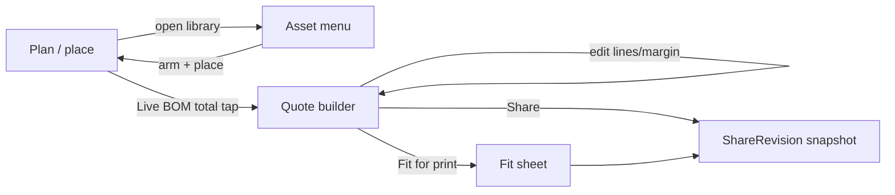

# Design return — Canvas-first asset menu + full quote builder

> Handover from design/architecture (Claude) → implementation (Cursor).
> Two features in one return: **(A)** a canvas-first, no-clutter asset menu, and
> **(B)** an editable full quote builder evolved from the read-only Fit Sheet.
> Both are **desktop + mobile first-class** (375 / 720 / 960+), not limited on either.

---

## 0. Meta

| Field | Value |
| --- | --- |
| **Designer / architect** | Claude (chief design + architect) |
| **Date** | 2026-07-27 |
| **Figma file** | n/a — spec-first handover (redlines in this doc; symbols already SVG in `studioCatalog`) |
| **Pages in scope** | `04 — Design studio` (handoff canvas) |
| **Replaces / extends** | `features/assetPanel/*`, `features/commandPalette/*`; `features/fitSheet/FitSheetOverlay.tsx` + the existing `ui.mode === "quote"` surface |
| **Eng contact** | Cursor (implementation) |
| **Target ship** | Staged PRs — see §11 |

**Summary:** The asset menu already uses a collapsible dock (`AssetPanel`) plus a
command palette, but presents too much persistent chrome. We make placement
**command-first, dock-second**, with a mobile bottom-sheet peer so the canvas is
never occluded by default. Separately, the Fit Sheet is a read-only plot sheet;
we evolve it (and the stub `quote` mode) into a **full editable quote builder**
layered on the existing estimate engine (`StudioEstimateReport` /
`buildSketchLineItems`) — sections, line editing, margin, alternates, exclusions,
GST, and client export via the existing `ShareRevision` snapshot. Both surfaces
are fully responsive; no new AI dependency — the logic is the catalog + rate card.

---

## 1. Scope

### In scope

- **(A)** Command-palette-first asset placement; auto-collapsing desktop dock; mobile bottom-sheet asset browser; recents + mode-aware ranking driven by catalog/rate-card data.
- **(B)** Editable quote document: engine-derived lines + operator overrides (qty/rate/notes), custom lines, sections, per-section and global margin/markup, alternates, exclusions/provisional flags, live GST roll-up, persist, and freeze-to-share export.
- Full **desktop + mobile** layouts for both (375 / 720 / 960+), keyboard on desktop, touch/gesture on mobile.

### Out of scope (explicit)

- No new AI placement or AI pricing. Ranking and costing are deterministic core logic.
- No CAD-accuracy claims — honesty copy preserved on canvas and quote ("indicative — not a formal tender").
- No change to Vicmap hydrate / dwelling-outline logic (verified correct separately).
- No new global colour/type system — reuse `globals.css` / `colorTokens.ts`.
- Portal (Curtis & Co client skin) export styling beyond the existing ShareRevision path.

### Product constraints acknowledged

- [x] Concept sketch, not CAD — honesty copy preserved
- [x] 2D top-down aerial only
- [x] Accent ≤3% surface (reserved for Save, armed, primary CTA)
- [x] No Phase 6 AI assist
- [x] Operator = Workstream brand; portal = Curtis & Co on export only

---

## 2. Screens & routes

| Screen | Route | Breakpoints |
| --- | --- | --- |
| Design studio — plan / place | `/projects/:id/design/studio` | 375 / 720 / 960+ |
| Asset menu (dock + palette + mobile sheet) | same route, canvas overlay | 375 / 720 / 960+ |
| Quote builder (`ui.mode === "quote"`) | same route, mode swap | 375 / 720 / 960+ |
| Fit sheet (`ui.mode === "fit"`) | same route, mode swap | 375 / 720 / 960+ |

**Mode flow:**



---

## 3. Layout spec

### (A) Asset menu — responsive

| Region | Desktop 960+ | Tablet 720 | Mobile 375 |
| --- | --- | --- | --- |
| Placement entry | `⌘K` / `/` command palette (primary); dock rail (secondary) | same | Long-press canvas or `+` FAB → command sheet |
| Browse dock | Left `CameraChrome` dock; **collapsed slim rail (≈56px)** by default, expands to ≈320px library on pin/hover | collapsible, overlays canvas (not side-by-side) | **Bottom sheet**: peek row (recents + swatches ≈72px), drag-up to full library |
| Placing state | Path-grammar inline panel (existing `AssetPanelPlacing`) | same | Placing controls in bottom sheet header, thumb-reachable |
| Canvas occlusion | none when idle (rail collapsed) | none | none (sheet peeks only) |

Rules: one `CameraChrome` dock slot only — never a second asset floater (existing
invariant, keep it). Dock auto-collapses on canvas interaction and after a
placement. No oversized persistent cards anywhere.

### (B) Quote builder — responsive

| Region | Desktop 960+ | Tablet 720 | Mobile 375 |
| --- | --- | --- | --- |
| Layout | Two-pane: plan preview (left, ≈40%) + editable quote (right, ≈60%); toggle to full-width quote | Stacked: collapsible plan strip on top, quote below | Full-screen quote; plan behind a "View plan" toggle |
| Sections | Accordion groups (Sitework / Hardscape / Planting / Drainage / Provisional / Custom) | same | Accordion, one open at a time |
| Line row | Label · unit · qty · rate · total · overflow (notes/exclude/alt) inline | same | Row shows label + total; tap row → edit drawer (qty/rate/notes) |
| Totals | Sticky right footer: subtotal, margin, GST, total incl GST | sticky bottom | **Sticky bottom bar** always visible; total incl GST prominent |
| Actions | Add line, Reset to engine, Fit, Share in a top action row | same | Bottom action bar (Add, Share); Fit in overflow |

**Spacing/grid:** 4px grid; 44px min row height on mobile; 16px input font on all editable fields (iOS zoom guard).

---

## 4. Design tokens

### Unchanged (reference only)

Reuse `apps/web/src/styles/globals.css` and `styles/colorTokens.ts`
(`SEMANTIC_LIGHT`, `mixOnHex`). Numerics use Geist Mono / `tabular-nums`.

### New tokens (engineering adds to globals.css first)

| Token name | Light | Dark | Usage |
| --- | --- | --- | --- |
| `--quote-provisional` | amber-tinted (reuse `--warn` mix) | same | Provisional / excluded line marker |
| `--quote-margin-accent` | reuse `--accent` at ≤3% | same | Margin field emphasis only |
| `--dock-rail-collapsed-w` | `56px` | — | Collapsed asset rail width |
| `--sheet-peek-h` | `72px` | — | Mobile asset sheet peek height |

No new colour *scales* — all derive from existing semantic tokens via `mixOnHex`.

### Changed / deprecated

None. (If the oversized meta cards left any dead CSS, remove in the asset PR.)

---

## 5. Component inventory

| Component | State / variant | Code target | Notes |
| --- | --- | --- | --- |
| Asset dock | collapsed / expanded / placing | `features/assetPanel/AssetPanel.tsx` (+ `assetPanel.module.css`) | Add `collapsed` default + auto-collapse; keep single dock slot |
| Command palette | search / arm-to-place | `features/commandPalette/StudioCommandPalette.tsx` | Make primary placement path; fuzzy over `BY_TYPE` + `rate_card_sku`; recents + mode ranking |
| Live BOM dock | total / advanced / horizon | `features/bom/LiveBomDock.tsx` | `onOpenQuote` opens the new builder; keep as canvas HUD |
| Fit sheet | read-only plot | `features/fitSheet/FitSheetOverlay.tsx` | Stays as **print** surface; quote is a sibling mode, not merged |
| Margin control | — | `features/trade/AmbientBudgetMargin.tsx` | Reuse inside quote totals |

**New components:**

| Name | Responsibility | Suggested path |
| --- | --- | --- |
| `AssetCommandSheet` | Mobile bottom-sheet wrapper for palette + browse (peek/expand) | `features/assetPanel/AssetCommandSheet.tsx` |
| `QuoteBuilder` | Editable quote surface (sections, rows, totals, actions), responsive | `features/quote/QuoteBuilder.tsx` |
| `QuoteLineRow` | One editable line (qty/rate/notes/exclude/alt); desktop inline + mobile edit drawer | `features/quote/QuoteLineRow.tsx` |
| `QuoteTotalsBar` | Sticky subtotal / margin / GST / total incl GST | `features/quote/QuoteTotalsBar.tsx` |
| `useQuoteDoc` | Merge engine lines + overrides + custom lines; derive totals; persist | `features/quote/useQuoteDoc.ts` |

---

## 6. Interaction & behaviour

### (A) Asset menu

| Action | Expected behaviour |
| --- | --- |
| `⌘K` / `/` (desktop) | Open command palette; type filters catalog by name + SKU + category; Enter arms top result |
| Arm + click canvas | Places armed asset at cursor; dock auto-collapses; palette closes |
| Long-press canvas / `+` FAB (mobile) | Open `AssetCommandSheet` at peek; search or pick recent; tap arms; tap canvas places |
| Pin dock (desktop) | Rail expands to library and stays until unpinned |
| Idle / after place | Dock returns to slim rail; no canvas occlusion |
| Eyedropper | Existing behaviour retained |

Ranking (deterministic, no AI): exact-SKU > name prefix > category match, then
recents, then current mode relevance (e.g. planting mode boosts flora). Source
data: `studioCatalog.BY_TYPE`, `PAINT_SWATCHES`, catalog `rate_card_sku`.

### (B) Quote builder

| Action | Expected behaviour |
| --- | --- |
| Open (Live BOM total tap / mode) | Build `QuoteDoc` from `StudioEstimateReport`; group into sections |
| Edit qty / rate / notes | Writes an **override** keyed by line id/sku; total + GST recompute live; original engine value recoverable |
| Add custom line | Appends operator line (label/unit/qty/rate); flagged non-engine |
| Remove / exclude line | Soft exclude (kept, struck, sub-totalled out) or mark provisional |
| Alternate | Attach optional variant line; excluded from base total until selected |
| Margin | Per-section and global markup %; applied before GST; shown transparently |
| Reset to engine | Drops overrides for that line/section; re-derives from live estimate |
| Re-estimate after plan edit | Engine lines refresh; overrides re-merge by sku; orphaned overrides surfaced, not silently dropped |
| Share | Freeze current `QuoteDoc` → `ShareRevision.snapshot.quoteLines` + `totalInclGst` (existing path) |

### Keyboard (desktop)

| Key | Action |
| --- | --- |
| `⌘K` / `/` | Asset command palette |
| `Q` | Toggle quote mode |
| `Enter` | Commit edited field / arm top palette result |
| `Esc` | Close palette / cancel edit / collapse dock |
| `⌘Z` | Undo (canvas + quote edits share history where feasible) |

### Modes / accent

| Mode | Visual | Accent? |
| --- | --- | --- |
| Plan (modeless) | canvas full | No |
| Armed (placing) | cursor ghost + slim rail | Yes (≤3%) |
| Quote | sheet/pane, mono numerics | No (accent only on primary CTA + margin field) |

---

## 7. Copy deck (en-AU, sentence case)

| Location | Element | Copy |
| --- | --- | --- |
| Asset palette | Placeholder | Search assets — type to place |
| Asset sheet (mobile) | Peek label | Recent · tap to place |
| Quote | H1 | Quote |
| Quote | Section heads | Sitework · Hardscape · Planting · Drainage · Provisional · Custom |
| Quote | Totals | Subtotal · Margin · GST (10%) · Total incl GST |
| Quote line | Exclude action | Exclude from quote |
| Quote line | Provisional tag | Provisional |
| Quote | Reset action | Reset to estimate |
| Quote | Honesty footer | Indicative — confirm before tender. Prices ex-supplier at time of estimate. |
| Quote | Share confirm | Share quote to client? This locks revision {A}. |

All AUD via `Intl.NumberFormat("en-AU", { currency: "AUD" })` (as in `LiveBomDock`). GST math per AU (10%, roll-up incl GST).

---

## 8. States

| State | Surface | Engineering notes |
| --- | --- | --- |
| Dock collapsed (default) | Asset | slim rail, no occlusion |
| Dock expanded / pinned | Asset | 320px library |
| Sheet peek / expanded | Asset (mobile) | 72px peek → full |
| Placing | Asset | path-grammar controls |
| Quote empty | Quote | "Place assets with rate SKUs to build a quote" + CTA to library (mirror `runSketchCosting` empty error) |
| Quote dirty | Quote | overrides present; Reset available; autosave pulse |
| Quote saved | Quote | timestamp; persisted `Costing` |
| Quote shared | Quote | revision letter stamp; snapshot frozen |
| Loading estimate | Quote / BOM | **skeleton pulse** (reuse `settling` pattern), not spinner |
| Re-estimate merge conflict | Quote | orphaned-override banner, not silent drop |

---

## 9. Accessibility

| Requirement | How met |
| --- | --- |
| Contrast AA | Line text on sheet ≥ AA; provisional marker not colour-only (adds "Provisional" text + strike) |
| Focus visible | ring on palette results, line fields, section heads |
| Touch targets | ≥44px rows/controls on mobile; sheet drag handle ≥44px |
| Input font | 16px on qty/rate/notes (iOS zoom guard) |
| Reduced motion | sheet/rail transitions respect `prefers-reduced-motion`; no essential info in motion |
| Screen reader | palette is a combobox/listbox; quote is a table with row/col headers; icon-only actions labelled |

**Known risks:** two-pane quote at 720 is tight — default to stacked below 900px, not 720. Command palette must not trap focus behind the mobile sheet.

---

## 10. Data model & core logic (architecture)

**Principle:** never mutate the estimate engine. The quote is an *overlay*.

Flow: `buildSketchLineItems` / `StudioEstimateReport` (derived, live)
→ `QuoteDoc` (editable overlay) → persisted `Costing` (existing contract)
→ frozen `ShareSnapshot.quoteLines` on share.

Reuse existing contracts (`packages/contracts/src/schemas/costing.ts`):
`LineItem { sku, label, unit, qty, rate, total, notes, is_provisional }`,
`Costing { scenario, line_items, subtotal, gst, total }`. `CostScenario` stays
`lean | standard | buffer` (do not repurpose for the quote — quote is a view over
the `standard` costing plus overrides).

**New contract — `QuoteDocSchema`** (add to contracts first, per repo rule):

```ts
QuoteSectionId = enum(sitework, hardscape, planting, drainage, provisional, custom)
QuoteOverride  = { sku, qty?, rate?, notes?, excluded?, section?, alternateOf? }
QuoteCustomLine = LineItem & { id, section: QuoteSectionId }
QuoteMargin    = { global_pct, by_section: Record<QuoteSectionId, number> }
QuoteDoc       = {
  project_id, design_id,
  overrides: QuoteOverride[],
  custom_lines: QuoteCustomLine[],
  margin: QuoteMargin,
  updated_at
}
```

`useQuoteDoc` merges: engine lines → apply override by `sku` → append custom
lines → group by section → apply section+global margin → GST roll-up → totals.
Persist `QuoteDoc` on the project (new store array, mirror `_costings`); the
derived, margined result maps to `Costing.line_items` for the existing
`costings` route and to `ShareSnapshot.quoteLines` on share.

**Server:** extend `sketch-cost-job.ts` / `costings` route to accept a stored
`QuoteDoc` and return the merged, margined `Costing`. Keep `runSketchCosting`
as the engine; add a `resolveQuote(costingEngineResult, quoteDoc)` domain
function in `packages/domain` (unit-testable, no server).

**Honesty / audit:** provisional and margin are always visible; excluded lines
are retained (struck) not deleted (matches "don't soften deletes silently").

---

## 11. Implementation sequencing (PR breakdown)

Small, revertable PRs (Conventional Commits, one concern each). Sequence chosen
to avoid the current WIP in `stickyMeta` / `survey`.

1. `feat(assets): command-first placement + auto-collapsing dock` — palette as primary path, dock defaults collapsed, ranking from catalog/SKU. Desktop. — **✅ landed 2026-07-27, QA passed (see §13)**
2. `feat(assets): mobile asset command sheet` — `AssetCommandSheet` peek/expand, tap-to-arm placement.
3. `feat(contracts): QuoteDoc schema + resolveQuote domain fn` — contracts + `packages/domain` merge/margin/GST logic + unit tests. No UI.
4. `feat(quote): editable QuoteBuilder (desktop two-pane)` — sections, line editing, totals, reset-to-estimate, persist.
5. `feat(quote): mobile quote sheet + sticky totals` — full-screen, edit drawer, bottom bar.
6. `feat(quote): margin, alternates, exclusions + share freeze` — wire to `ShareRevision.quoteLines`.
7. `chore(assets): remove dead oversized-card CSS` (if any remains).

Each PR: desktop + mobile screenshots at 375 / 960, CSS modules listed, tests green.

---

## 12. Acceptance criteria & tests

**Asset menu**

- Canvas is unoccluded when idle on desktop (rail collapsed) and mobile (sheet peek).
- `⌘K` → type → Enter → click places the right asset; dock auto-collapses after.
- Mobile: long-press/`+` → sheet → tap asset → tap canvas places; one-handed reachable.
- Palette ranking is deterministic (unit test over `BY_TYPE` + SKUs).

**Quote builder**

- Opening from a costed plan yields sectioned lines matching the live BOM total before overrides.
- Editing qty/rate updates line + subtotal + GST + total live; Reset restores engine value.
- Custom line, exclude, provisional, alternate, and margin each recompute totals correctly (domain unit tests on `resolveQuote`).
- Re-estimate after a plan change re-merges overrides by sku; orphans surfaced, not dropped.
- Share freezes `quoteLines` + `totalInclGst` into `ShareRevision` (existing snapshot test extended).
- Full parity + usability at 375 and 960; 44px targets; 16px inputs; AA contrast; reduced-motion respected.

**Verification note:** unit tests should run via `pnpm --filter @workstream/web test`
and `pnpm --filter @workstream/api test`; the domain `resolveQuote` tests live in
`packages/domain`. (Author could not execute vitest in the authoring sandbox —
the pnpm symlink store doesn't resolve there — so run these locally before merge.)

---

## 13. QA log (design sign-off)

### PR1 — command-first placement + auto-collapsing dock · ✅ Signed off 2026-07-27

Verified in-tree against §6/§12 (not from the handback report alone):

- Ranking `assetCommandRank.ts`: exact SKU (1000) → SKU prefix (900) → name/tag prefix (800) → category/word-prefix (600) → substring (400) → all-tokens (300) → reject; recents + mode boosts; deterministic name tiebreak; `existing` types excluded. 14 unit tests green.
- `/` shortcut guarded (`!typing && !cmdOpen && !meta/ctrl/alt`).
- Dock defaults collapsed (`panel ?? "collapsed"`); pin via `libraryPinned`; auto-collapse pure/testable; rail persists when a right panel opens; tokens `--dock-rail-collapsed-w`/`--sheet-peek-h` present.
- A11y: palette `role="dialog"` + `role="option"`; `prefers-reduced-motion` zeroes transitions.

**Carry-forward (non-blocking) — fold into PR2:**

1. Promote palette to input `role="combobox"` + results `role="listbox"` with `aria-activedescendant` on the highlighted row (fuller AA/SR parity than dialog+option).
2. Add a test asserting every `STUDIO_TYPE_SKUS` alias resolves to a real rate-card SKU (drift guard).
3. Confirm collapsed-rail buttons are ≥44px for coarse pointers.

### PR2 — mobile `AssetCommandSheet` · reminders

`--sheet-peek-h: 72px` already in. Tap-to-arm → tap-canvas placement; honour safe-area insets; carry the combobox/listbox a11y from PR1 item 1; ensure the palette is not focus-trapped behind the sheet (§9 risk).

### PRs 3–7 — turnkey, no further design input needed

Contracts + `resolveQuote` (§10), editable `QuoteBuilder` desktop, mobile quote sheet, margin/alternates/exclusions + share freeze, dead-CSS cleanup. Acceptance in §12; build in the §11 order. Cross-cutting Tier-1 gaps (dwelling-outline containment filter G4/G5, mobile parity gate) tracked in `../design/operator-redesign/design_handoff_landscape_cad_studio/TIER1-GAP-ANALYSIS-2026-07-27.md`.
