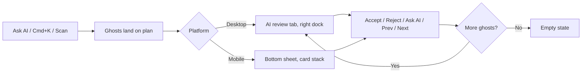

# Design return — Unified AI-review panel (mobile card stack vs desktop tabbed dock)

---

## 0. Meta

| Field | Value |
| --- | --- |
| **Designer** | Tim |
| **Date** | 2026-08-05 |
| **Source** | `unified_panel_wireframes_mobile_swipe_vs_desktop_tabs.html` (static wireframe, not Figma — low-fidelity, layout/interaction only) |
| **Replaces / extends** | Desktop: extends `AiGhostReview.tsx` (`apps/web/src/components/canvas/handoff/features/aiGhosts/`) with new tabbed-dock chrome. Mobile: replaces the bulk apply/clear ghost UI in `MobileSketchBottomSheet.tsx` with per-item review. |
| **Eng contact** | — |
| **Target ship** | Not scheduled — this doc is the spec-first pass before either half gets built |

**Summary:** Two platform-specific surfaces for reviewing AI-suggested ("ghost") plan items — a full-width swipeable card stack for mobile, a compact tabbed side dock for desktop — sharing one interaction contract (select, accept, reject, ask AI, cycle) instead of one shared component. Desktop's review *content* already exists (`AiGhostReview.tsx`); what's new on desktop is the 4-tab dock chrome around it. Mobile has no per-item review today — only bulk accept-all/clear-all — so the mobile half is new build, not a reskin.

---

## 1. Scope

### In scope

- The interaction contract and data shape shared by both platforms (§5, §11).
- Desktop: wrapping the existing `AiGhostReview` in a persistent-but-summoned 4-tab dock (Assets / Quote / AI review / Images).
- Mobile: a swipeable, one-card-at-a-time review stack replacing the current bulk ghost actions.

### Out of scope (explicit)

- Pixel-level visual design. The wireframe is layout/interaction only — no token values, no final type/spacing were specified, so none are prescribed here either.
- The Assets and Images tabs' own content design (they exist independently — `AssetPanel`/`AssetPanelExpanded`, `ImageLayerPanel`). This doc only specifies how they sit in the dock alongside AI review.
- Actual implementation. This is the spec Tim asked for before either surface gets built.

### Product constraints acknowledged

- [x] AI is a spatial collaborator inside the drawing, not a chatbot (`CAD-AI-2026-UX.md`) — both surfaces keep the ghost visible on-plan behind/around the review card, never a full-screen modal that hides the drawing.
- [x] Ghosts never silent-write — accept/reject stays explicit on both platforms.
- [x] Progressive disclosure / disappearing interface (`STUDIO-STYLING-AND-UX.md` §4.2) — the desktop dock stays hidden-until-summoned; see §11 lane-law note, this is the one place this proposal needs a decision, not just a build.
- [x] `apps/web` and `apps/mobile` are forked codebases (`CLAUDE.md`) — no shared component; shared contract only (§11).
- [x] 44px minimum touch targets on mobile / on-site (`[data-density="onsite"]`).

---

## 2. Screens & routes

| Screen | Route | Platform |
| --- | --- | --- |
| CAD / Sketch mode, AI review dock | `/projects/:id?mode=cad` (also reachable from Sketch) | Web — wraps existing `AiGhostReview` |
| Sketch bottom sheet, AI hints section | `design-studio/[id]` | Mobile — replaces bulk ghost actions in `MobileSketchBottomSheet` |

---

## 3. Layout spec

### Desktop — tabbed dock (right lane)

| Region | Behaviour |
| --- | --- |
| Tab strip | 4 tabs — Assets, Quote, AI review, Images — one row, active tab underlined. This is one occupant of the right lane (§11), not four simultaneously open panels. |
| Detail card | Selected ghost: icon, name, confidence %, live notes, cost delta. Already built in `AiGhostReview` — reuse as-is inside the new tab body. |
| Action row | Accept (A/Enter) · Reject (R) · Ask AI · Prev · Next — already built, keyboard hints already inline. |
| Queue list | Remaining ghosts below the action row, decreasing opacity by distance from current (wireframe shows 100% / 60% / 40%) — this list exists in `AiGhostReview` today as `.list` but currently sits *above* the detail card, not below it. Confirm with Tim whether the wireframe's below-detail ordering is an intentional change or just wireframe simplification before reordering the real component. |

### Mobile — swipeable card stack (bottom sheet)

| Region | Behaviour |
| --- | --- |
| Sheet | Reuse the existing `@gorhom/bottom-sheet` instance in `MobileSketchBottomSheet` (snap points `22% / 48% / 88%`) rather than introducing a second sheet mechanism. |
| Card | Full-width, one ghost at a time. Chevron affordances left/right for prev/next (matches desktop's Prev/Next). Next card peeks behind — standard card-stack depth cue. |
| Actions | Two thumb-height (≥44px, ideally ≥56px given this is an on-site/gloved-hands context per `CLAUDE.md`'s on-site density rule) buttons: Reject / Accept. |
| Gesture | Swipe right = accept, swipe left = reject, in addition to the buttons — gesture is a shortcut, never the only path (accessibility, §9). |

---

## 4. Design tokens

No new tokens needed for either platform — this reuses each platform's existing accept/reject/warning colour roles (`--success`/`--danger` family on web, `@workstream/ui` tokens on mobile). If build turns up a gap, add it here before implementing, don't invent inline.

---

## 5. Component inventory

| Piece | Platform | Code target | Status |
| --- | --- | --- | --- |
| Ghost detail card, confidence factors, accept/reject/ask-AI/cycle | Web | `AiGhostReview.tsx` | **Exists** — reuse, don't rebuild |
| 4-tab dock chrome (Assets/Quote/AI review/Images) | Web | **NEW** — suggest `apps/web/src/components/canvas/handoff/features/panelDock/PanelDock.tsx` | New wrapper only; each tab's content already exists independently |
| Bottom sheet mechanics (snap points, backdrop, handle) | Mobile | `MobileSketchBottomSheet.tsx` | **Exists** — reuse |
| Bulk ghost actions (`onApplyGhosts`, `onClearGhosts`) | Mobile | `MobileSketchBottomSheet.tsx` | **Exists but superseded** — per-item review replaces bulk-only actions. Keep "accept all" as a secondary action if there's a fast-path use case; don't remove without confirming that's not load-bearing for someone. |
| Per-item swipeable review card | Mobile | **NEW** — suggest `apps/mobile/src/components/sketch/GhostReviewCard.tsx` | New — genuinely nothing like this exists on mobile today |

---

## 6. Interaction & behaviour

### Desktop

| Action | Expected behaviour |
| --- | --- |
| Click tab | Switches dock content; does not open a second panel (lane law, §11) |
| A / Enter | Accept selected ghost |
| R | Reject selected ghost (second press without a reason = "reject without reason", per existing `AiGhostReview` behaviour) |
| Click confidence bar | Expand/collapse factor breakdown (existing) |
| Prev / Next | Cycle selection within the queue |

### Mobile

| Action | Expected behaviour |
| --- | --- |
| Swipe card right | Accept, next card animates forward |
| Swipe card left | Reject, next card animates forward |
| Tap Accept / Reject | Same effect as swipe — required alternative, not everyone can/wants to swipe |
| Tap chevron | Prev / next without accept or reject (browse only) |
| Last card cleared | Falls through to empty state (§8) |

---

## 7. Copy deck (en-AU)

No new copy beyond what's already shipped in `AiGhostReview`'s empty state ("No pending ghosts... Use Ask AI or Cmd+K to Scan"). Mobile empty state should say the mobile-appropriate equivalent ("Tap Scan site to check for suggestions" or similar) — exact string TBD with Tim, not guessed here.

---

## 8. States

| State | Screen | Notes |
| --- | --- | --- |
| Empty (no ghosts) | Both | Existing desktop copy as reference |
| Reviewing | Both | Default |
| Stale ghost | Desktop exists (`data-stale`, "Stale — re-check site" badge) — mobile needs the same treatment, currently absent | Carry the stale concept to mobile, don't silently drop it |
| Last card / queue empty | Mobile | Card stack collapses to empty state, not a dead swipe gesture |
| Scanning in progress | Mobile exists (`scanning` prop, "Scanning…" label) — desktop equivalent not checked in this pass | |

---

## 9. Accessibility

| Requirement | How this meets it |
| --- | --- |
| Touch targets | Mobile Accept/Reject ≥44px per `CLAUDE.md` on-site rule; wireframe shows 40px height buttons, bump to at least 44px in the real build |
| Gesture is optional | Swipe must have a tappable equivalent (§6) — screen-reader and motor-impaired users can't be swipe-only |
| Keyboard path | Desktop already has one (A/Enter/R) — no change needed |
| Screen reader | Mobile card needs an accessible label announcing item name + confidence + available actions, not just visual swipe affordance |
| Reduced motion | Card-stack transition and dock tab-switch must respect reduced-motion (existing app-wide rule in `globals.css`) |

---

## 10. Assets & export

Nothing new — reuses existing catalog symbol glyphs (`speciesSymbols.tsx` / `packages/domain/src/catalog-assets.ts`) on both platforms.

---

## 11. Engineering implementation notes

**Shared data shape — open question, not resolved in this pass.** Desktop's `AiGhostReview` takes `ghosts: StudioItem[]` (a `.ghost`-flagged item in the same shape as accepted plan items). Mobile's ghost UI takes `ghosts: GhostPlacementSuggestion[]` from `@workstream/domain` — a different, currently-unverified-as-identical type. Before building the mobile card stack, confirm whether `GhostPlacementSuggestion` and the web `StudioItem` ghost shape are the same data or two independent representations of "an AI suggestion." If they've diverged, that's the actual first fix — reviewing a ghost should mean the same thing on both platforms.

**Lane-law decision needed (`STUDIO-SURFACES.md`).** The right lane holds ONE summoned panel at a time, hidden until summoned by default. Reading the dock's 4 tabs as 4 *occupants of that one slot* (switched by tab, not stacked open) is lane-law compliant. Reading it as a *persistent always-visible 4-tab bar* is not — that adds permanent chrome the binding docs explicitly rule out (`STUDIO-STYLING-AND-UX.md` §4.2, "AI sidecar collapsed by default"). Build it as the former. If Tim wants the dock pinned open by default, that's a product decision to raise explicitly against the binding doc, not something to route around quietly.

**Suggested build order:**

1. Resolve the `StudioItem` ghost vs `GhostPlacementSuggestion` question (blocks mobile work; may also inform desktop if they should converge).
2. Desktop: build `PanelDock` as a thin tab wrapper around the three-plus existing panels (Assets, Quote, AI review, Images), reusing `AiGhostReview` unchanged. Lower risk, content already works.
3. Mobile: build the swipeable card, wire it to real accept/reject handlers, add stale-ghost parity, add accessible tap alternative to swipe.
4. Confirm queue-list ordering (above vs below detail) with Tim per the §3 note before treating the wireframe's layout as final.

**Do not break:**

- `AiGhostReview`'s existing keyboard shortcuts and `data-testid`s (`cad-ghost-review`, `ai-ghost-empty`, `ghost-confidence-toggle`, `ghost-live-notes`, `ghost-live-drift`, `ghost-rejection-reasons`) — e2e specs likely depend on these; check `apps/web/e2e/` before renaming anything.
- The rejection-reason flow (`placement` / `style` / `cost` → feeds `buildSessionRejectionPrompt` per `docs/design/UIUX-DESIGNER-HANDOFF-SPEC.md`'s AI section) — don't simplify this away on either platform without checking what consumes it.

**Open questions for eng:**

| # | Question | Design preference |
| --- | --- | --- |
| 1 | Is `GhostPlacementSuggestion` (mobile) the same shape as ghost-flagged `StudioItem` (web), or does one need to change? | Prefer converging on one shape rather than maintaining two, but defer to whichever is less disruptive to ship |
| 2 | Queue list above or below the detail card on desktop? | Wireframe shows below; current `AiGhostReview` has it above — confirm before reordering |
| 3 | Does "accept all" stay as a fast path on mobile alongside per-item review? | Lean yes, as a secondary action, not the only action |
| 4 | Dock tabs: switched-single-occupant or persistent bar? | Switched-single-occupant, per lane law — flagged above as the compliant read |

---

## 12. Sign-off

Not applicable yet — this is the spec-first pass Tim asked for. Fill in once a build is scheduled.
