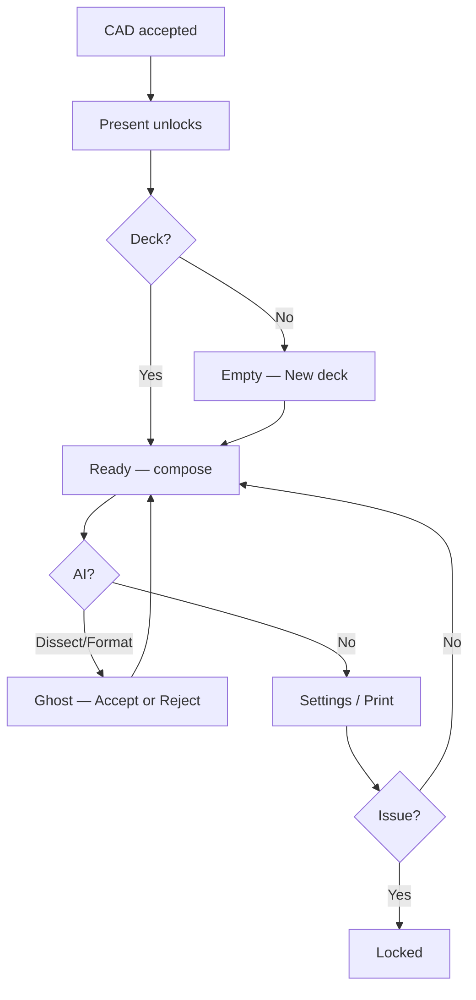

# Present mode — designer brief

**Title:** Refactoring the authoring surface — canvas-first UI & AI orchestration for quotation / meeting-deck assembly  
**Audience:** Frontend graphic designer  
**Product:** Workstream operator studio (Curtis & Co landscape co-pilot)  
**Surface:** `/projects/[id]?mode=present` → `PresentSurface`  
**Platform:** Desktop-first web (`apps/web`)  
**Date:** 2026-08-09  
**Scope:** Workflow 1 (indicative CAD → meeting deck). Stage 2 survey-grade CAD is out of scope.

**Pair with (required):** [`STUDIO-STYLING-AND-UX.md`](../STUDIO-STYLING-AND-UX.md) — binding gallery frame, frost docks, tokens, forbidden looks.  
**Also:** [`DESIGNER-FEATURE-INVENTORY.md`](../DESIGNER-FEATURE-INVENTORY.md) · [`CAD-AI-2026-UX.md`](../CAD-AI-2026-UX.md) · [`TIER1-2026-FRONTEND-DESIGN-SPEC.md`](./TIER1-2026-FRONTEND-DESIGN-SPEC.md)

---

## 1. Positioning

Enterprise AEC SaaS has moved to a **canvas-first** authoring model: multi-modal AI may propose inside a spatial workbench, while the operator keeps total authorial control.

Present is that workbench for **document assembly** — synthesizing Phase 1 indicative CAD geometry, financial ledgers, and aesthetic tokens into coherent client deliverables.

| Present **is** | Present **is not** |
|----------------|--------------------|
| Active **assembly workbench** for meeting decks / quotation pages | **Client presentation** (View → Client presentation) — chrome-off share-screen theatre |
| Operator authoring of pages, panels, and AI-reviewed layouts | **Share** — client portal URL + liability gate |
| Live-bound plan crops + estimate widgets (until issue) | A second CAD drafting canvas or Fit sheet |
| Desktop-first web composition | Stage 2 survey-grade CAD / paper space |

One sentence: **Present turns the working drawing into a client-facing deck the operator builds page by page.**

---

## 2. Core identity — the disappearing interface

**Product law:** *The drawing is the product.*

- Application chrome must never appear as a fixed opaque slab parked on the plan or page paper.
- Progressive disclosure + idle recession: idle rails fade after ~6 seconds (studio frame; Present suspends idle while docks / reviews are open).
- Visual identity: **dark grey gallery frame** · **cream / parchment page paper** · **frost docks**.
- Retired / forbidden: blush-pink page washes as studio chrome, purple glows, default Inter/Roboto as the product UI stack, dashboard card soup.
- Sentence case labels · AU locale (en-AU, AUD, GST) · WCAG AA text on composited chrome.

---

## 3. Architectural gateway — CAD binding & unlock

Present is a viewport onto a **reactive** studio store. The authoring surface stays locked until underlying CAD geometry is accepted.

| Gate | Behaviour |
|------|-----------|
| Locked | Mode tab disabled |
| Locked copy | `Accept CAD geometry before presenting.` |
| Unlocked | Accepted CAD exists (placements, strokes, or zones) — Present binds to live plan snapshot + estimate |

**Engineering truth (for designers):** Plan crops are **%-coordinate board snapshots** of the handoff parchment plan (boundary, building, items, strokes) — not a separate WebGL CAD viewport. Design them as live plan windows on paper, not as a second 3D engine.

In AEC terms: spatial geometry → material quantification → estimate → widgets. Present must not pretend to invent geometry the board does not have.

---

## 4. Spatial ergonomics — two dialects (never mix)

Frost / glass UI lives **outside** the zoom/rotate camera (`CameraChrome` → `camera-chrome-root`). Never parent glass inside `.zoomWorld`.

| Component | Placement | Visual dialect |
|-----------|-----------|----------------|
| **Gallery frame** (top / side / bottom bands) | Outer studio shell | Flat monochrome IDE icons — transparent rest, `--ws-frame-wash` hover, `--ws-frame-ink-*` glyphs. No plastic chips in the frame. |
| **Deck settings dock** | Summoned right inspector | Frost / dark translucent inspector (`--hc-glass` / frame-mix). Title, Deliverable, Template, Palette, Font. |
| **Add / AI toolbars** | Over the Present workspace (not a sticky idle ribbon on the page) | Calm kit buttons; summoned pickers. |
| **Page paper (active canvas)** | Central viewport | Pure rendering surface — cream/parchment sheet (`--sheet-*` kinship). The artwork. |
| **Ghost reviews** | Overlay when Dissect / Format runs | Elevated review cards — Accept / Reject / Accept all. |

---

## 5. Content primitives — live data assembly

Panels ingest data from unlocked CAD geometry and the live estimation engine.

| Panel | Data source & behaviour |
|-------|-------------------------|
| **Text** | Operator strings; theme typography (see §8) |
| **Plan crop** | Live board snapshot bound to accepted CAD (%-coords); label / reason from Dissect; sync when board revision moves |
| **Image** | Canvas image layers (import in Sketch/CAD first if empty) |
| **Swatch board** | Material chips from placed board materials; columns + caption |
| **Widget** | Live subscription to estimate / materials until the deck is issued |

### Widgets

| Widget | Intent |
|--------|--------|
| Quote total | Synchronised AUD total incl. GST |
| Savings ledger | Indicative ledger lines |
| Zone summary | Zone / area metrics |
| Material swatches | Live finish chips |
| Caption | Short editorial caption |
| Honesty footer | Explicit disclaimer — e.g. indicative pricing / *Concept sketch for estimating — not a construction drawing.* |

Widgets read as **instrument readouts**, not marketing stat pills.

---

## 6. AI orchestration — Dissect, Format, human gate

AI is a **spatial intern**. All proposals are ephemeral **ghosts**. AI must never silent-write into the deck.

**Human gate (Accept XOR Reject before advance):** drafting tools yield while a review is open; the operator must Accept, Accept all, or Reject before returning to ready compose.

### AI Dissect

1. Operator triggers **Dissect plan**.  
2. System proposes plan-crop ghosts (label, reason, crop rect).  
3. Operator **Accept** (one) · **Accept all** · **Reject**.  
4. Accepted ghosts become `plan_crop` panels.

### AI Format

1. Requires ≥1 panel on the page.  
2. **Format page** proposes layout rects from the selected Template.  
3. Layout ghosts appear; operator Accept / Reject per panel or Accept all.  
4. Never auto-apply without Accept.

### Apply template

Template-driven layout pass — treat visually as a strong / careful action (can reshape the page).

**Design ask:** Present ghosts should feel editorial (paper overlays), related to but distinct from CAD board ghosts.

---

## 7. Deliverables, templates, palettes

Hardcoded hex in shipped chrome is forbidden; resolve via CSS variables (`--hc-*`, `--ws-frame-*`, `--sheet-*`, semantic aliases).

### Deliverable types

| Deliverable | Intent |
|-------------|--------|
| Client deck | Meeting narrative — plan crops + story text |
| Quotation | Price-forward — quote widgets + honesty |
| Mood board | Material / image heavy |
| Concept sketch | Early intent — sketch-forward imagery + light copy |

### Grid templates

| Template | Character |
|----------|-----------|
| Editorial classic | Print margins, multi-column balance |
| Editorial minimal | Expansive negative space, aggressive alignment |
| Editorial feature | Visual impact — plan crops may feel feature-bleed |
| Editorial schedule | Dense tabular / widget + swatch structure |

### Palettes (content theme — not studio chrome)

| Palette | Mood |
|---------|------|
| Stone | High-contrast greys |
| Sage | Muted landscape greens |
| Ink | Deep saturated dark editorial |
| Blush | Warm accent **on the page content only** — never reintroduce blush-pink as studio chrome |
| Parchment | Warm beige / cream kinship with Fit sheet |

---

## 8. Typography

| Face | Role |
|------|------|
| **Fraunces** | Display / primary headers where used |
| **Sora** | Core UI and interface labels |
| **IBM Plex Mono** | Meta, financial ledgers, CAD-adjacent labels |
| **Inter** | Optional deck content font (theme picker) |
| **Architects Daughter** (`Hand-written` theme / `--font-hand`) | Hand-lettered presentation DNA on content — **never** chrome or HUD |

---

## 9. Finite states & user logic flow

Deck lifecycle is a small, deterministic state machine — avoid inventing parallel modes.

| State | Meaning | Designer treatment |
|-------|---------|-------------------|
| **Empty** | Present unlocked; no deck selected | Banner + empty workspace + New deck |
| **Ready** | Draft deck open; composing | Normal page + toolbars; autosave → top-bar save chip |
| **Ghost** | Dissect or Format review open | Banner `ghost`; review overlay; drafting suspended until Accept/Reject |
| **Locked** | Deck issued | Banner `locked`; issued badge; freeze treatment — edits blocked; live figures read as fixed snapshot |

### Operator flow

```text
Accept CAD geometry
  → Present tab unlocks
  → New deck (or select existing)
  → Add pages
  → Compose panels (text · crops · images · swatches · widgets)
  → Optional: Dissect → Accept/Reject ghosts
  → Optional: Format → Accept/Reject layout ghosts
  → Deck settings (title · deliverable · template · palette · font)
  → Print meeting pack
  → Issue → Locked (terminal freeze)
```



---

## 10. Screen inventory (regions to design)

One composition: sidebar + page stage + bottom nav — not a multi-dashboard.

| Region | Contents |
|--------|----------|
| Surface banner | empty · ready · ghost · locked copy |
| Sidebar (~260px) | Back · Present · New deck · deck list · delete |
| Toolbar | Deck title · Deck settings · Print |
| Deck settings dock | Title · Deliverable · Template · Palette · Font |
| Page paper | Panels + select/resize chrome |
| Add bar | Add text · plan crop · swatch board · image · widget |
| AI bar | Dissect plan · Format page · Apply template |
| Pickers | Image picker · Widget picker |
| Ghost reviews | Dissect list · Format list |
| Page nav | Tabs · count · Add page |

---

## 11. Copy bank (sentence case)

| Context | Copy |
|---------|------|
| Mode lock | Accept CAD geometry before presenting. |
| Empty banner | Empty — create a deck to start composing |
| Ready banner | Ready — compose pages and panels |
| Ghost banner | Ghost review — accept or reject proposals before issuing |
| Locked banner | Locked — this deck is issued; edits are blocked |
| Empty workspace | Select a deck or create one to start composing. |
| No pages | No pages. Add one to start composing. |
| Image empty | No image layers on the canvas. Import a photo or plan underlay in Sketch or CAD mode first. |
| Board honesty | Concept sketch for estimating — not a construction drawing. |
| Widget honesty | Indicative pricing only. Final quote subject to site conditions. |
| AI | Dissect plan · Format page · Apply template |
| Ghost actions | Accept · Accept all · Reject |

---

## 12. Designer deliverable pack (Figma)

**Pack name:** Present mode — meeting deck assembly  

1. Shell wire + hi-fi — empty / ready / locked  
2. Deck settings dock — all fields  
3. Page paper system — margins, type scale, panel chrome  
4. Panel kit — text, plan crop, image, swatch board, each widget  
5. Add + AI toolbars — rest / hover / loading / disabled  
6. Ghost reviews — Dissect + Format  
7. Deliverable samples — 4 deliverables × 2 templates (cover + interior)  
8. Palette applied samples — Stone / Sage / Ink / Blush / Parchment on one page  
9. Print preview — A4 / Letter  
10. Motion notes — dock in, ghost arrive, page tab (2–3 intentional motions)

---

## 13. Related surfaces (do not merge)

| Surface | Relationship |
|---------|--------------|
| Client presentation | Chrome-off plan theatre |
| Fit sheet (**F**) | Cream working drawing on the plan |
| Quote / Live cost | Right-lane BOM on CAD — feeds widgets |
| Share / portal | Client URL after costed quote |

---

## 14. Engineering anchors

| Area | Path |
|------|------|
| Surface | `apps/web/src/components/canvas/handoff/features/present/PresentSurface.tsx` |
| Deck settings | `…/present/DeckInspectorDock.tsx` |
| Styles | `present.module.css`, `deckInspectorDock.module.css` |
| Contracts | `packages/contracts/src/schemas/presentation-document.ts` |
| Unlock | `apps/web/src/lib/canvas-mode.ts` |
| E2E | `apps/web/e2e/present-surface-state.spec.ts` |
| Binding styling law | `docs/STUDIO-STYLING-AND-UX.md` |

---

## 15. Out of scope

- Redesigning CAD, Fit sheet, or Quote rail in this pack  
- R3F / WebGL as Present’s primary page renderer  
- Real-time multi-user co-editing  
- Client portal quote/deposit screens (separate pack)  
- Stage 2 survey-grade sheet export  

---

By enforcing rigid visual dialects, retiring chrome blush, constraining typography, and gating AI through Accept/Reject, Present remains a disciplined assembly engine for professional landscape architecture workflows — not a chatbot and not a second CAD.

*End of Present mode designer brief.*
