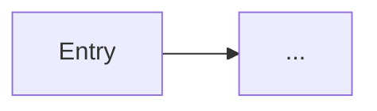

# Design return — [Feature name]

> Copy this file to `docs/design-returns/YYYY-MM-DD-<short-name>.md` when handing back to engineering.
> Delete instructional lines in blockquotes as you fill sections.

---

## 0. Meta

| Field | Value |
| --- | --- |
| **Designer** | |
| **Date** | |
| **Figma file** | [link] |
| **Figma page(s) in scope** | e.g. `04 — Design studio` |
| **Replaces / extends** | e.g. current `/design/studio` layout |
| **Eng contact** | |
| **Target ship** | |

**Summary (2–3 sentences):** What changed and why.

---

## 1. Scope

### In scope

- 

### Out of scope (explicit)

- 

### Product constraints acknowledged

- [ ] Concept sketch, not CAD — honesty copy preserved
- [ ] 2D top-down aerial only
- [ ] Accent ≤3% surface (Save + armed mode)
- [ ] No Phase 6 AI assist unless separate eng ticket
- [ ] Operator = Workstream brand; portal = Curtis & Co (if touching portal)

---

## 2. Screens & routes

| Screen | Route | Breakpoints designed |
| --- | --- | --- |
| | `/projects/:id/design/studio` | 375 / 720 / 960+ |
| | | |

**Flow diagram** (link Figma prototype or paste mermaid):

---

## 3. Layout spec

### Global chrome (if changed)

| Region | Height / behaviour | Sticky? | Notes |
| --- | --- | --- | --- |
| AppNav | | | |
| Masthead | | | |
| Subnav | | | |
| Bottom bar (mobile) | | | |

### Design studio layout (if in scope)

| Region | Desktop | Tablet | Mobile |
| --- | --- | --- | --- |
| Toolbar | | | |
| Canvas | | | |
| Asset rail | 320px? | | stack order? |
| Honesty caption | | | |

**Grid / spacing notes:**

---

## 4. Design tokens

### Unchanged (reference only)

Uses existing `apps/web/src/styles/globals.css`.

### New tokens (engineering adds to globals.css first)

| Token name | Light value | Dark value | Usage |
| --- | --- | --- | --- |
| | | | |

### Changed tokens

| Token | Was | Now | Migration notes |
| --- | --- | --- | --- |
| | | | |

### Deprecated tokens

| Token | Replace with |
| --- | --- |
| | |

---

## 5. Component inventory

Map Figma components → code target (existing or **NEW**).

| Figma component | Variant / state | Code target | Notes |
| --- | --- | --- | --- |
| Button / Primary | default, loading | `app.module.css` `.btn` | |
| Design studio / Asset tile | default, active, TRP | `designAssetPalette.module.css` | |
| | | | |

**New components needed:**

| Name | Responsibility | Suggested path |
| --- | --- | --- |
| | | `apps/web/src/components/...` |

---

## 6. Interaction & behaviour

### Design studio (if in scope)

| Action | Expected behaviour |
| --- | --- |
| Click asset in rail | |
| Click empty canvas | |
| Click placed symbol | |
| Save | |
| Aerial load failure | |

### Keyboard shortcuts

| Key | Action |
| --- | --- |
| P | Place |
| D | Draw |
| V | Select |
| Esc | |
| Delete | |
| Ctrl+Z | |

### Modes

| Mode | Visual | Accent used? |
| --- | --- | --- |
| Auto / modeless | | No |
| Place armed | | Yes |
| Draw armed | | Yes |
| Select | | No |

---

## 7. Copy deck (en-AU)

All user-visible strings. Sentence case for headings and buttons.

| Location | Element | Copy | Notes |
| --- | --- | --- | --- |
| Studio page | H1 | Design studio | |
| Studio canvas | Honesty caption | Concept sketch for estimating — not a construction drawing. | **Required** |
| Save toast | Body | | Must mention draftsperson |
| | | | |

---

## 8. States

| State | Screen | Figma frame name | Engineering notes |
| --- | --- | --- | --- |
| Empty canvas | Studio | | |
| Armed symbol | Studio | | |
| Selected symbol | Studio | | |
| Saving | Studio | | spinner in Save |
| Saved | Studio | | autosave label |
| Aerial error | Studio | | retry |
| No survey gate | Studio | | CTA to survey |
| Loading route | Project tab | | skeleton |

---

## 9. Accessibility

| Requirement | How design meets it |
| --- | --- |
| Contrast AA | e.g. asset labels `#52525B` on `#FFFFFF` = … |
| Focus visible | ring colour / offset |
| Touch targets | ≥44px — list exceptions |
| Reduced motion | no essential info in animation only |
| Screen reader | labels for icon-only controls |

**Known risks:**

---

## 10. Assets & export

| Asset | Format | Delivery |
| --- | --- | --- |
| Studio symbols | SVG path `d` | Not PNG — spec in domain catalog or Settings upload doc |
| Icons | SVG | |
| Marketing stills | PNG/WebP | `/apps/web/public/` if needed |

**Do not export:** Mapbox aerial tiles (dynamic from API).

---

## 11. Engineering implementation notes

**Suggested build order:**

1. 
2. 
3. 

**Do not break:**

- `DesignCanvas` payload shape (`placements`, `strokes`, `updated_at`)
- Percent-based placement (`x_pct`, `y_pct` 0–100)
- Honesty copy zones (§7)

**Open questions for eng:**

| # | Question | Design preference |
| --- | --- | --- |
| 1 | | |

---

## 12. Sign-off

### Design complete

- [ ] Figma matches this doc
- [ ] All §3–§9 sections filled
- [ ] Token map reviewed with eng

**Designer sign-off:** _________________ **Date:** _______

### Engineering build

| PR | Branch | Preview URL |
| --- | --- | --- |
| | | |

### Design QA

| Check | Pass? | Notes |
| --- | --- | --- |
| 375 mobile | | |
| 960 desktop | | |
| Dark mode | | |
| Honesty copy visible | | |
| Accent budget | | |
| Keyboard path | | |

**Design QA sign-off:** _________________ **Date:** _______

**Punch list (if not pass):**

1. 

---

*Template version: 2026-05-21 · Standard: [DESIGN-HANDOVER-FORMAT.md](../DESIGN-HANDOVER-FORMAT.md)*
